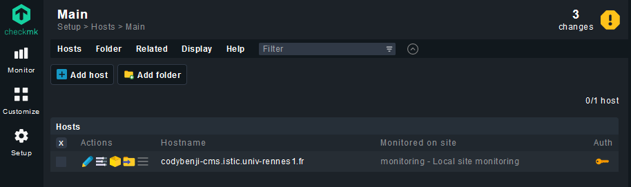

- [1. Introduction](#1-introduction)
- [2. Choix des technologies](#2-choix-des-technologies)
- [3. Prérequis](#3-prérequis)
- [4. Installation et configuration](#4-installation-et-configuration)
  - [4.1. Initialisation de la VM](#41-initialisation-de-la-vm)
    - [4.1.1. Création de la VM Debian](#411-création-de-la-vm-debian)
    - [4.1.b Connection à la VM](#41b-connection-à-la-vm)
  - [4.2. Installation de Nginx (tutoriel)](#42-installation-de-nginx-tutoriel)
  - [4.3. Wordpress](#43-wordpress)
    - [4.2.a. Installation de Wordpress](#42a-installation-de-wordpress)
    - [4.2.b. Configuration de Nginx avec Wordpress](#42b-configuration-de-nginx-avec-wordpress)
  - [4.4. MySQL et PhpMyAdmin](#44-mysql-et-phpmyadmin)
    - [4.4.a. Installation de MySQL et PhpMyAdmin](#44a-installation-de-mysql-et-phpmyadmin)
    - [4.3.a. Configuration de Nginx avec PhpMyAdmin](#43a-configuration-de-nginx-avec-phpmyadmin)
    - [4.3.b. Connexion de la base de donnée à Wordpress](#43b-connexion-de-la-base-de-donnée-à-wordpress)
- [5. Initialisation du CMS](#5-initialisation-du-cms)
  - [5.1. Ajout d'utilisateurs](#51-ajout-dutilisateurs)
- [6. Certificat auto-signé SSL tutoriel](#6-certificat-auto-signé-ssl-tutoriel)
  - [6.1. Génération du certificat](#61-génération-du-certificat)
  - [6.2. Configuration de Nginx](#62-configuration-de-nginx)
- [6. Monitoring : Check MK](#6-monitoring--check-mk)
  - [6.1. Installation de Check MK](#61-installation-de-check-mk)
  - [6.2. Installation de l'agent](#62-installation-de-lagent)
    - [6.3 Ajout de l'hôte](#63-ajout-de-lhôte)
- [7. Mot de passe et aspect d'amélioration](#7-mot-de-passe-et-aspect-damélioration)


# 1. Introduction 

Le présent document traite de l'installation et de la configuration d'un système de gestion de contenu (CMS) pour l'entreprise fictive TechnoGenix. TechnoGenix est une entreprise spécialisée dans le développement de solutions technologiques innovantes et la fourniture de services d'expertise dans le domaine de l'informatique. Ses clients sont principalement des entreprises du secteur des technologies de l'information et de la communication (TIC), des organismes publics et des institutions éducatives.

Le service informatique de TechnoGenix a identifié le besoin de créer un site vitrine sur Internet pour promouvoir les produits et services de l'entreprise. Pour répondre à ce besoin, le service informatique a choisi de déployer un CMS, qui permettra aux membres de l'équipe de communication de gérer facilement le contenu du site web sans avoir besoin de compétences techniques avancées. De plus, le service informatique souhaite que le CMS soit basé sur des technologies maîtrisées par l'équipe, telles que Debian ou Ubuntu, Apache ou Nginx, MySQL / MariaDB ou PostgreSQL.

Ce document décrit en détail la procédure d'installation et de configuration du CMS, ainsi que les exigences techniques et fonctionnelles qui doivent être respectées. Il servira de guide pour les personnes chargées de l'installation et de la maintenance du CMS, ainsi que pour les membres du service communication et du service informatique qui souhaitent comprendre les choix techniques réalisés et les étapes suivies pour mettre en place le système.


# 2. Choix des technologies

Choix des technologies et argumentation

Afin de mettre en place un système de gestion de contenu adapté aux besoins de l'entreprise TechnoGenix, plusieurs choix technologiques ont été effectués. Dans cette section, nous présentons ces choix et expliquons les raisons qui ont motivé ces décisions.

1. **CMS** : Wordpress a été choisi comme CMS pour le site vitrine de TechnoGenix en raison de sa popularité et de son caractère open-source. En effet, Wordpress est largement utilisé dans l'industrie, ce qui garantit un support communautaire important et une multitude de plugins disponibles pour étendre ses fonctionnalités. De plus, son caractère open-source permet une personnalisation et une adaptation aux besoins spécifiques de l'entreprise.

2. **Base de données** : MySQL a été sélectionné comme système de gestion de base de données (SGBD) pour le CMS. Bien que MariaDB aurait également pu être utilisé, MySQL a été préféré en raison de sa compatibilité éprouvée avec Wordpress et de sa réputation en tant que solution performante et fiable. Néanmoins, MariaDB, étant un fork de MySQL, aurait également été une option viable.

3. **Superviseur** : CheckMK a été choisi comme outil de supervision du CMS et des services associés. CheckMK permet une surveillance efficace des performances du système, ainsi que la détection rapide des problèmes éventuels, ce qui est essentiel pour garantir la disponibilité et la fiabilité du site vitrine.

4. **Serveur** : NGINX a été sélectionné comme serveur web pour héberger le CMS. NGINX offre des performances élevées et une gestion efficace des ressources, ce qui est particulièrement avantageux pour les sites à fort trafic. De plus, sa configuration flexible et sa compatibilité avec de nombreuses technologies en font un choix judicieux pour le projet.

5. **Distribution** : Debian a été choisie comme distribution Linux pour héberger le CMS et les services associés. Debian est réputée pour sa stabilité et sa fiabilité, ce qui en fait un choix approprié pour un environnement de production. De plus, la compatibilité de Debian avec les autres technologies sélectionnées assure une intégration harmonieuse des différents éléments du système.

6. **Déploiement** : Les machines virtuelles (VM) de l'ISTIC ont été utilisés pour déployer le CMS, conformément aux exigences du projet. Ces templates facilitent la mise en place rapide et sécurisée de l'environnement nécessaire pour le CMS et les services associés. 

7. **Outils** : phpMyAdmin a été choisi comme outil de gestion de la base de données MySQL. phpMyAdmin permet une gestion simplifiée et conviviale des bases de données, ce qui facilite la maintenance et l'administration du CMS par les membres de l'équipe informatique.


# 3. Prérequis

Pour ce TP nous avons utiliser les VM de l'ISTIC dont l'ip est la suivante : `148.60.11.67`.
Nous avons également utiliser un nom de domaine : [codybenji-cms.istic.univ-rennes1.from](http://codybenji-cms.istic.univ-rennes1.fr) qui pointe vers l'IP de la VM sous Debian.

Nous nous sommes aidé de certains tutoriels pour installer ces outils qui seront cités dans chaque partie de ce document.


# 4. Installation et configuration

## 4.1. Initialisation de la VM 

### 4.1.1. Création de la VM Debian

Afin de créer la machine virtuelle (VM) Debian pour héberger le CMS et les services associés, nous avons utilisé le système mis en place par l'ISTIC. Ce système permet de créer et de gérer des VMs à distance via une interface web accessible à l'adresse suivante : [vm.istic.univ-rennes1.fr](https://vm.istic.univ-rennes1.fr/).

Pour créer la VM Debian, suivez les étapes ci-dessous :

1. Connectez-vous à l'interface web de gestion des VMs de l'ISTIC à l'adresse [vm.istic.univ-rennes1.fr](https://vm.istic.univ-rennes1.fr/) en utilisant vos identifiants ENT.
2. Cliquez sur le bouton "Demander une VM".
3. Sélectionnez le template de VM Debian dans la liste des templates disponibles.
4. Remplissez les informations requises pour la nouvelle VM, telles que le nom, la taille de la mémoire et du disque, etc.

Une fois la VM Debian créée, vous pourrez y accéder en utilisant le protocole SSH. Pour ce faire, vous devez vous assurer d'être connecté au réseau de l'ISTIC ou d'utiliser le VPN de l'ISTIC pour accéder au réseau depuis un emplacement distant.

Note : Les informations d'authentification et l'adresse IP de la VM vous seront fournies une fois la VM créée. Conservez ces informations en lieu sûr, car elles seront nécessaires pour accéder à la VM et la configurer ultérieurement.

### 4.1.b Connection à la VM

Pour vous connecter à la VM de notre entreprise, vous devez utiliser les identifiants suivants. Veuillez noter qu'il est important de changer le mot de passe par défaut en utilisant la commande `sudo passwd`, ce que nous avons déjà fait.

Pour établir une connexion SSH à la VM, utilisez la commande suivante :

```bash
# avec l'ip de la VM
ssh zprojet@148.60.11.67
# ou alors avec le nom de domaine
ssh zprojet@codybenji-cms.istic.univ-rennes1.fr
```

Lorsqu'il vous sera demandé, saisissez le mot de passe :

```bash
password: zebulon
```

Une fois connecté, vous pourrez accéder et gérer la VM en utilisant les commandes et les outils Linux habituels.
Avant de faire quoi que ce soit, il faut mettre à jour la liste des paquets disponibles et leurs versions avec la commande suivante : `sudo apt update`.

## 4.2. Installation de Nginx ([tutoriel](https://www.digitalocean.com/community/tutorials/how-to-install-nginx-on-debian-10))

Nginx permet de faire le pont entre notre serveur et le client ; il permet de gérer les requetes HTTP et HTTPS.

Pour l'installer NGINX, il faut utiliser la commande suivante : `sudo apt install nginx`.

> Sur le tutoriel le firewall de debian (ufw) est utilisé, néanmoins pour plus de practicité nous avons décidé de ne pas l'utiliser bien que dans un contexte de sécurité il est préférable de l'utiliser.


Enfin, pour lancer le service Nginx il faut utiliser la commande suivante : `sudo systemctl start nginx`.

Pour vérifier que Nginx est bien installé, il faut taper l'adresse IP de la VM dans un navigateur web. Si tout est bien configuré, on devrait voir la page suivante :


## 4.3. Wordpress

Wordpress est un CMS opensource qui permet de créer des sites web dynamiques. Selon le site [Saleforce](https://www.salesforce.com/fr/resources/articles/definition-cms/#topic2), un CMS est un outil qui permet de "créer, de gérer et de modifier facilement un site web, sans avoir besoin de connaissances techniques en langage informatique".

Il fait notamenent partie de WySiWyg (What You See Is What You Get) qui est un éditeur de texte qui permet de voir directement le rendu final du texte.

Pour l'installation de Wordpress nous n'avons pas suivis qu'un seul tutoriel mais une multitudes qui nous ont données des informations complémentaires : [Digital Ocean](https://www.digitalocean.com/community/tutorials/how-to-install-wordpress-with-lemp-nginx-mariadb-and-php-on-debian-10), [Spinupwp](https://spinupwp.com/hosting-wordpress-yourself-complete-nginx-configuration/).

### 4.2.a. Installation de Wordpress

Nous devons nous rendre dans le dossier `/var/www/html/` qui est le dossier racine de Nginx. Pour cela il faut utiliser la commande suivante : `cd /var/www/html/`.

L'installation de Wordpress passe par le téléchargement du package de Wordpress sur le site officiel grâce à la commande suivante : `wget https://wordpress.org/latest.tar.gz`, puis de sa décompression avec la commande suivante : `tar -xzvf latest.tar.gz`.

Ainsi nous nous retrouvons avec ceci : 
```bash
zprojet@debian:/var/www/html$ ls
index.html  phpmyadmin  wordpress
zprojet@debian:/var/www/html$ cd wordpress
zprojet@debian:/var/www/html/wordpress$ ls
index.php        wp-admin              wp-content         wp-load.php      wp-signup.php
license.txt      wp-blog-header.php    wp-cron.php        wp-login.php     wp-trackback.php
readme.html      wp-comments-post.php  wp-includes        wp-mail.php      xmlrpc.php
wp-activate.php  wp-config.php         wp-links-opml.php  wp-settings.php
```

### 4.2.b. Configuration de Nginx avec Wordpress

Nginx possède un dossier contenant des fichiers de configuration : `/etc/nginx/sites-available/`. Nous allons donc créer un nouveau fichier de configiration pour qu'il prenne en compte Wordpress :

```bash
zprojet@debian:/etc/nginx/sites-available$ ls
default  wordpress.conf
```

Voici le contenu du fichier `wordpress.conf` : 

```php
server {
  listen 80;  # port d'écoute Nginx
  root /var/www/html/wordpress;
  index index.php index.html index.html index.htm;
  server_name codybenjam.ddns.net; # nom de domaine que l'on a ajouté
  access_log /var/log/nginx/wordpress_access.log;
  error_log /var/log/nginx/wordpress_error.log;
  client_max_body_size 64M;
  location / {
      try_files $uri $uri/ /index.php?$args;
  }

  # Add the new location block for /phpmyadmin
  location /phpmyadmin {
      alias /var/www/html/phpmyadmin;
      index index.php;

      location ~ \.php$ {
          try_files $uri =404;
          fastcgi_split_path_info ^(.+\.php)(/.+)$;
          include /etc/nginx/fastcgi_params;
          fastcgi_read_timeout 3600s;
          fastcgi_buffer_size 128k;
          fastcgi_buffers 4 128k;
          fastcgi_param SCRIPT_FILENAME $request_filename;
          fastcgi_pass unix:/run/php/php7.4-fpm.sock;
          fastcgi_index index.php;
      }
  }

  # suport php
  location ~ \.php$ {
    try_files $uri =404;
    include /etc/nginx/fastcgi_params;
    fastcgi_read_timeout 3600s;
    fastcgi_buffer_size 128k;
    fastcgi_buffers 4 128k;
    fastcgi_param SCRIPT_FILENAME $document_root$fastcgi_script_name;
    fastcgi_pass unix:/run/php/php7.4-fpm.sock;
    fastcgi_index index.php;
  }
}
```
Sans rentrer dans les détails ce fichier permet de faire le lien entre Nginx et Wordpress.

Enfin la dernière étape consiste a effectivement dire à Nginx d'utiliser ce fichier de configuration. Pour cela il faut créer un lien symbolique entre le fichier de configuration et le dossier `/etc/nginx/sites-enabled/`.

Nous allons nous rendre dans le dossier `nginx` et éditer le fichier `nginx.conf` :

```bash
zprojet@debian:/etc/nginx$ ls
conf.d          koi-utf     modules-available  proxy_params     sites-enabled  win-utf
fastcgi.conf    koi-win     modules-enabled    scgi_params      snippets
fastcgi_params  mime.types  nginx.conf         sites-available  uwsgi_params
```

```bash
user www-data;
worker_processes auto;
pid /run/nginx.pid;
include /etc/nginx/modules-enabled/*.conf;

events {
	worker_connections 768;
	# multi_accept on;
}

http {
	# Basic Settings
	sendfile on;
	tcp_nopush on;
	types_hash_max_size 2048;
	# server_tokens off;
	# server_names_hash_bucket_size 64;
	# server_name_in_redirect off;

	include /etc/nginx/mime.types;
	default_type application/octet-stream;

	# SSL Settings
	ssl_protocols TLSv1 TLSv1.1 TLSv1.2 TLSv1.3; # Dropping SSLv3, ref: POODLE
	ssl_prefer_server_ciphers on;

	# Logging Settings
	access_log /var/log/nginx/access.log;
	error_log /var/log/nginx/error.log;

	# Gzip Settings
	gzip on;

	# Virtual Host Configs
	include /etc/nginx/conf.d/*.conf;   # ligne ajoutée
	include /etc/nginx/sites-enabled/*; # ligne ajoutée
}
```

Nous avons ajouter les deux dernières lignes.


## 4.4. MySQL et PhpMyAdmin

### 4.4.a. Installation de MySQL et PhpMyAdmin


**Installation de MySQL** : 

Guide suivit : [How To Install the Latest MySQL on Debian 10](https://www.digitalocean.com/community/tutorials/how-to-install-the-latest-mysql-on-debian-10)


Étapes importantes :
- `sudo apt install mysql-server` : installation de MySQL
- `mysql_secure_installation` : configuration de MySQL (mot de passe root, ...)
- `sudo systemctl start mysql` : démarrage du service MySQL

Voici les identifiants de connexion à la base de données : 

```bash
User: root
Password: pass: ' '
```


**Installation de PhpMyAdmin** : 

Guide suivit : [How To Install phpMyAdmin with Nginx on Debian 11 / Debian 10](https://www.itzgeek.com/how-tos/linux/debian/how-to-install-phpmyadmin-with-nginx-on-debian-10.html)


Le serveur apache est déjà installé sur la VM et utilise le port 80, il est donc necessaire de stopper le service apache : `sudo systemctl stop apache2.service`.


Name DB : phpmyadmin
host : localhost

user : pma               // n'as pas les droits root (je pense que c'est mieux de prendre ça pour Wordpress)
pass: pmapass

root user : root         // du coup ça c'est plus pour modif a la main je pense 
root pass: ' '


### 4.3.a. Configuration de Nginx avec PhpMyAdmin

La configutaion de PhpMyAdmin est similaire à celle de Wordpress. Nous allons donc créer un nouveau fichier de configiration pour qu'il prenne en compte PhpMyAdmin :

```bash
zprojet@debian:/etc/nginx/sites-available$ ls
default  phpmyadmin.conf  wordpress.conf
```

Voici le contenu du fichier `phpmyadmin.conf` : 

```conf
server {
  listen 80;
  root /var/www/html/phpmyadmin;
  index index.php index.html index.htm;
  server_name codybenjam.ddns.net;
  access_log /var/log/nginx/wordpress_access.log;
  error_log /var/log/nginx/wordpress_error.log;
  client_max_body_size 64M;
  location /phpmyadmin {
    try_files $uri $uri/ /index.php?$args;
  }

  location ~ \.php$ {
    try_files $uri =404;
    include /etc/nginx/fastcgi_params;
    fastcgi_read_timeout 3600s;
    fastcgi_buffer_size 128k;
    fastcgi_buffers 4 128k;
    fastcgi_param SCRIPT_FILENAME $document_root$fastcgi_script_name;
    fastcgi_pass unix:/run/php/php7.3-fpm.sock;
    fastcgi_index index.php;
  }
}
```

### 4.3.b. Connexion de la base de donnée à Wordpress

Pour que Wordpress puisse se connecter à la base de donnée il faut modifier le fichier `wp-config.php` :

```bash  
zprojet@debian:/var/www/html/wordpress$ ls
index.php        wp-admin              wp-content         wp-load.php      wp-signup.php
license.txt      wp-blog-header.php    wp-cron.php        wp-login.php     wp-trackback.php
readme.html      wp-comments-post.php  wp-includes        wp-mail.php      xmlrpc.php
wp-activate.php  wp-config.php         wp-links-opml.php  wp-settings.php
zprojet@debian:/var/www/html/wordpress$ nano wp-config.php
```

Et il faut modifier :
- Le nom de la base de donnée : 'phpmyadmin'
- Le nom d'utilisateur : 'pma'
- Le mot de passe : 'pmapass'
- Le hostname : 'localhost'

```bash
...
// ** Database settings - You can get this info from your web host ** //
/** The name of the database for WordPress */
define( 'DB_NAME', 'phpmyadmin' );

/** Database username */
define( 'DB_USER', 'pma' );

/** Database password */
define( 'DB_PASSWORD', 'pmapass' );

/** Database hostname */
define( 'DB_HOST', 'localhost' );

/** Database charset to use in creating database tables. */
define( 'DB_CHARSET', 'utf8' );

/** The database collate type. Don't change this if in doubt. */
define( 'DB_COLLATE', '' );
...
```

# 5. Initialisation du CMS

Maintenant que nous avons installé Wordpress et PhpMyAdmin nous allons pouvoir initialiser le CMS en nous rendont sur l'adresse IP de notre serveur.


Une fois avoir remplis les informations, créer un utiliateur et cliqué sur "Installer Wordpress" nous arrivons sur la page de connexion. En effet le CMS nous offre une interface d'administration sécurisée par une authentification individuelle.

## 5.1. Ajout d'utilisateurs

Nous souhaitons avoir plusieurs utilisateurs avec des rôles différents, pour cela une fois connexté au CMS nous allons dans "Utilisateurs" puis "Ajouter".


Les trois utilisateurs créer sont : 
- admin : Administrateur (Administrator)
- beta : Editeur (Editor)
- omega : Rédacteur (Subscriber)


# 6. Certificat auto-signé SSL [tutoriel](https://www.tremplin-numerique.org/comment-creer-et-utiliser-un-ssl-auto-signe-dans-nginx-cloudsavvy-it)

## 6.1. Génération du certificat

Pour générer un certificat auto-signé SSL, il faut utiliser l'utilitaire `openssl` : `sudo apt-get install openssl`.

Générer le certificat en remplissant les champs demandés :
```sudo openssl req -x509 -nodes -days 365 -newkey rsa:2048 -keyout /etc/ssl/private/nginx.key -out /etc/ssl/certs/nginx.crt```

 ```bash	
 zprojet@debian:/var/www/html/wordpress$ sudo openssl req -x509 -nodes -days 365 -newkey rsa:2048 -keyout /etc/ssl/private/nginx.key -out /etc/ssl/certs/nginx.crt
Generating a RSA private key
....+++++
.......+++++
writing new private key to '/etc/ssl/private/nginx.key'
-----
You are about to be asked to enter information that will be incorporated
into your certificate request.
What you are about to enter is what is called a Distinguished Name or a DN.
There are quite a few fields but you can leave some blank
For some fields there will be a default value,
If you enter '.', the field will be left blank.
-----
Country Name (2 letter code) [AU]:FR
State or Province Name (full name) [Some-State]:Britany
Locality Name (eg, city) []:Rennes
Organization Name (eg, company) [Internet Widgits Pty Ltd]:esir
Organizational Unit Name (eg, section) []:esir
Common Name (e.g. server FQDN or YOUR name) []:http://codybenji-cms.istic.univ-rennes1.fr
Email Address []:bdezordo@gmail.com
```

## 6.2. Configuration de Nginx

Pour que Nginx prenne en compte le certificat il faut créer un fichier de configuration `self-signed.conf` dans le dossier `/etc/nginx/snippets/` :

```bash
zprojet@debian:/home$ cd /etc/nginx/snippets
zprojet@debian:/etc/nginx/snippets$ ls
fastcgi-php.conf  snakeoil.conf
zprojet@debian:/etc/nginx/snippets$ touch self-signed.conf
zprojet@debian:/etc/nginx/snippets$ ls
fastcgi-php.conf  self-signed.conf  snakeoil.conf
```

```bash
ssl_certificate /etc/ssl/certs/nginx.crt;
ssl_certificate_key /etc/ssl/private/nginx.key;

ssl_protocols TLSv1.2;
ssl_prefer_server_ciphers on;
ssl_ciphers ECDHE-RSA-AES256-GCM-SHA512:DHE-RSA-AES256-GCM-SHA512:ECDHE-RSA-AES256-GCM-SHA384:DHE-RSA-AES256-GCM-SHA384:ECDHE-RSA-AES256-SHA384;
ssl_session_timeout 10m;
ssl_session_cache shared:SSL:10m;
ssl_session_tickets off;
ssl_stapling on;
ssl_stapling_verify on;
resolver 8.8.8.8 8.8.4.4 valid=300s;
resolver_timeout 5s;
add_header X-Frame-Options DENY;
add_header X-Content-Type-Options nosniff;
add_header X-XSS-Protection "1; mode=block";
```

Maintenant, rendez-vous dans le fichier de configuration de Nginx `/etc/nginx/sites-enabled/wordpress.conf` et ajouter les lignes suivantes :

```bash
server {
    listen 443 ssl;
    listen (::):443 ssl;

    include ../snippets/self-signed.conf;

    server_name codybenji-cms.istic.univ-rennes1.fr www.codybenji-cms.istic.univ-rennes1.fr;
    . . .
}
```

Enfin, redémarrer Nginx avec `sudo systemctl restart nginx` pour prendre en compte les modifications.

/!\ Malheureusement cette solution n'a pas fonctionné et les logs ne nous on pas permi d'identifier le problème. Une solution que nous aurions proposé est d'utiliser Nginx Proxy Manager qui permet de gérer les certificats SSL de manière plus simple et intuitive via une interface web. Néanmoins, cette solution necessite l'enmploi d'un Docker ce qui n'étais pas le but ici.


# 6. Monitoring : Check MK

Le monitoring permet surveiller l'état et les performances des différents composants d'un système informatique (serveurs, réseaux, applications, etc.) afin de détecter les problèmes potentiels et pouvoir réagir rapidement en cas de dysfonctionnement.

Checkmk est une solution de monitoring open source que nous utiliserons fans le but de monitorer notre serveur.

## 6.1. Installation de Check MK

Nous avons recréer un serveur Debian afin d'y installer CheckMK via le tutoriel du TP2. Une fois installé, nous avons accès à l'interface web, via : `cmkbdezordo.istic.univ-rennes1.fr/monitoring`.
Les credentials administrateurs sont données lors de l'intallation et sont a changer par la suite.

## 6.2. Installation de l'agent

Afin de pouvoir monitorer notre serveur nous devons ajouter un hôte. Mais avant cela nous devont installer sur le serveur monitorer un "Agent" qui permettra de communiquer avec Check MK. 

Nous avons choisit le package le plus basique : `check-mk-agent_2.2.0b7-1_all.deb` que nous avons télécharger sur le serveur de Wordpress avec : 
```bash	
zprojet@debian:~$ sudo wget http://cmkbdezordo.istic.univ-rennes1.fr/monitoring/check_mk/agents/check-
check-mk-agent_2.2.0b7-1_ 100%[===================================>]   3,82M  --.-KB/s    ds 0,01s
zprojet@debian:~$ sudo dpkg -i check-mk-agent_2.2.0b7-1_all.deb
```

Puis on vérifie que le port de communication est bien ouvert : `sudo ss -lnptu | grep 6556`

### 6.3 Ajout de l'hôte

Enfin nous devons dire à Check Mk vers qui se tourner pour établir la communication avec l'agent. Pour cela nous allons dans l'interface web et nous cliquons sur "Setup", "Host", "Ad new host" puis nous renseignons l'url du serveur monitorer : `http://codybenji-cms.istic.univ-rennes1.fr`, puis on clique sur "Save & run service discovery".




# 7. Mot de passe et aspect d'amélioration

Le long de notre TP pour plus de simplicité nous avons utiliser les mots de passe faibles que nous nous transmétions. Néanmoins, lors d'un projet réel il aurait été préférable d'utiliser une base de données de mots de passe sécurisée comme BitWarden qui permet de créer des groupes et de partager des mots de passe entre les membres. De plus, BitWarden permet de générer des mots de passe aléatoires et de les stocker de manière sécurisée selon des critères définis par l'utilisateur.
